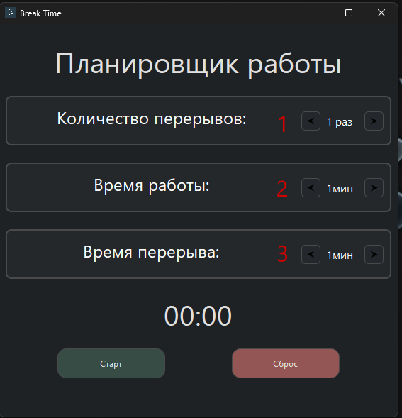

# Break Time

**Break Time** — это компьютерное минималистичное приложение на Qt для контроля рабочего времени и перерывов. Помогает соблюдать режим работы и отдыха, повышая продуктивность и снижая усталость. Окно на перерыв не закроется пока не законячится время на перерыв, в этом отличие этой программы от других аналогов!

## Возможности

- Таймер рабочего времени  
- Таймер перерыва  
- Звуковые оповещения  
- Настройка длительности работы и отдыха  

## Скриншоты

## Использование

1. Скачайте архив, разарвируйте и запустите BreakTime.exe
2. Установите количество перерывов(1 номер).
3. Установите время работы в минутах(2 номер).
4. Установите время перерыва в минутах(3 номер).
5. Нажмите **Старт**, после того как таймер пошел нельзя редактировать.
6. Если что то пошло не так, нажмите **Сброс**.
7. По завершении рабочего таймера начнётся таймер перерыва.
8. По окончании перерыва можно продолжить сессию.

# Changelog

## [1.0.0] - 2025-05-23
- Первая рабочая версия Break Time
- Таймер работы и перерывов
- Выбор количества перерывов
- Звуковые уведомления (за 5 секунд до начала перерыва и за 5 секунд окончания перерыва)
- Жёсткий режим (нельзя закрыть окно во время перерыва)

## [Планы на 1.1.0]
- Добавить возможность откладывать перерыв
- Добавить логирование сессий
- Горячие клавиши Старт/Пауза/Сброс 
- Версия для Linux (планируется но не известно когда)

## Автор

- **yenox**

## Обратная связь

Если у вас есть идеи, предложения или замечания по улучшению программы — пишите мне!  
Можно связаться через:

- Telegram: **@y3nox**
- Email: **y3nohx@gmail.com**
---

## Лицензия

MIT License
